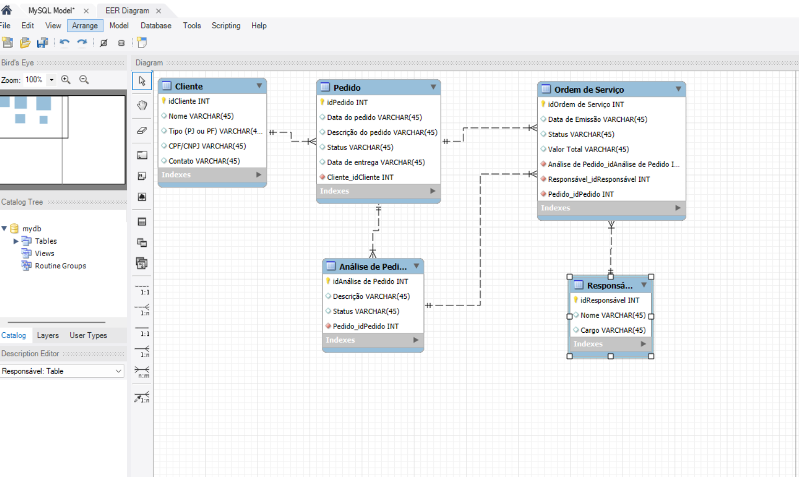

# Sistema de Gestão de Ordem de Serviço

## Contexto do Projeto
Este projeto consiste em criar um esquema conceitual para a gestão de ordens de serviço, incluindo o cadastro de clientes, a criação de pedidos, a análise de pedidos e a execução de ordens de serviço.

## Entidades Principais
- **Cliente**: Representa o cliente que faz os pedidos, podendo ser Pessoa Física (PF) ou Pessoa Jurídica (PJ).
- **Pedido**: Detalha o pedido realizado pelo cliente.
- **Análise de Pedido**: Registra a avaliação e o status do pedido.
- **Responsável**: Identifica a pessoa ou equipe encarregada pelo pedido e execução.
- **Ordem de Serviço (OS)**: Centraliza a execução dos serviços do pedido.

## Relacionamentos
- Um **Cliente** pode realizar múltiplos **Pedidos**.
- Um **Pedido** pode passar por uma **Análise de Pedido**.
- Cada **Ordem de Serviço** é vinculada a um **Pedido** e possui um **Responsável**.

## Estrutura do Repositório
- `README.md`: Explicação do esquema conceitual.
- `diagram_os.png`: Imagem do diagrama de entidade-relacionamento (ER) do cenário.

## Observação
Caso encontre algo a ajustar ou refinar, sugestões são bem-vindas!
